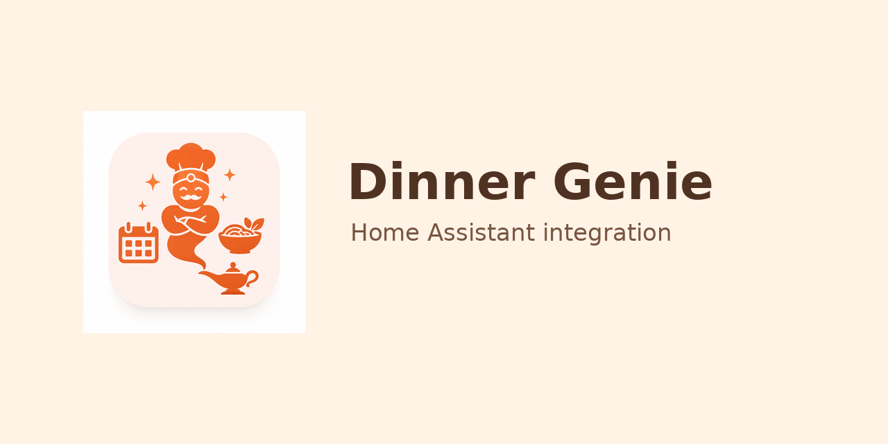

# Dinner Genie Home Assistant integration



[](https://github.com/mhholtkamp/dinner_genie/actions/workflows/hassfest.yaml)
[](https://github.com/mhholtkamp/dinner_genie/actions/workflows/hacs.yaml)
[](https://github.com/mhholtkamp/dinner_genie/actions/workflows/python.yaml)

Custom integration voor Dinner Genie.

## Installatie via HACS custom repository

1. Voeg deze repository toe in HACS als type `Integration`.
2. Installeer Dinner Genie.
3. Herstart Home Assistant.
4. Ga naar **Instellingen > Apparaten & diensten > Integratie toevoegen**.
5. Kies **Dinner Genie**.
6. Vul in:
   - API basis-URL, bijvoorbeeld `https://dinner-genie.vercel.app/api`
   - Groeps-ID
   - API key

## Entiteiten

De integratie maakt automatisch deze entiteiten aan:

- `number.dinner_genie_aantal_dagen` maximaal 7
- `number.dinner_genie_aantal_personen`
- `button.dinner_genie_genereer_weekmenu`
- `button.dinner_genie_kies_willekeurig_gerecht`
- `sensor.dinner_genie_aantal_recepten`
- `sensor.dinner_genie_willekeurig_gerecht`
- `sensor.dinner_genie_weekmenu`
- `sensor.dinner_genie_dag_1`
- `sensor.dinner_genie_dag_2`
- `sensor.dinner_genie_dag_3`
- `sensor.dinner_genie_dag_4`
- `sensor.dinner_genie_dag_5`
- `sensor.dinner_genie_dag_6`
- `sensor.dinner_genie_dag_7`
- `todo.dinner_genie_boodschappen`
- `select.dinner_genie_dieet`
- `select.dinner_genie_recepttype`

## Gebruik

Stel het aantal dagen en personen in met de number-entiteiten. Druk daarna op **Genereer weekmenu**.

De integratie roept dan aan:

```text
/api/groups/{groupId}/week-plan?days=5&servings=4
```

met de waarden uit Home Assistant.

## Maaltijden bekijken

Naast de overzichtssensor `sensor.dinner_genie_weekmenu` maakt de integratie nu ook per dag een sensor aan.

Bijvoorbeeld:

```text
sensor.dinner_genie_dag_1
```

De state is de naam van het gerecht. In de attributes staan onder andere:

- `description`
- `prep_time`
- `category`
- `diet_type`
- `servings`
- `ingredients`
- `ingredients_v2`
- `instructions`
- `image_url`
- `recipe_id`

Je kunt dus op de dagsensor klikken om de bereiding en ingrediënten te bekijken.


## Afbeeldingen

Als een recept geen `imageUrl` heeft, gebruikt de integratie automatisch de meegeleverde placeholder. Gebruik in dashboards bij voorkeur het attribuut `display_image` of `image_url`.


## Voorbeeld dashboards

Deze repository bevat voorbeeld dashboards:

```text
examples/dashboard_sections.yaml
examples/dashboard_minimal.yaml
examples/dashboard_mobile.yaml
```

Dezelfde voorbeelden staan ook in:

```text
custom_components/dinner_genie/examples/
```

Voor het complete sections dashboard zijn deze HACS frontend kaarten handig:

```text
Button Card
Card Mod
```

Gebruik `dashboard_minimal.yaml` als je zonder custom frontend kaarten wilt starten.

## Eén dag vervangen

Vanaf versie 2.2.0 maakt de integratie per dag een vervangknop aan:

```text
button.dinner_genie_vervang_dag_1
button.dinner_genie_vervang_dag_2
...
button.dinner_genie_vervang_dag_7
```

Als je een dag vervangt, kiest Dinner Genie een gerecht dat nog niet in de andere dagen van het weekmenu staat. Daarna wordt de boodschappenlijst opnieuw opgebouwd op basis van het actuele weekmenu.

## Lovelace card

Vanaf v2.3.0 bevat Dinner Genie een eigen Lovelace card. Voeg deze resource toe in Home Assistant:

```text
/api/dinner_genie/www/dinner-genie-card.js
```

Type: JavaScript module.

Als Home Assistant een oude versie blijft laden, voeg tijdelijk een versie-query toe, bijvoorbeeld:

```text
/api/dinner_genie/www/dinner-genie-card.js?v=2.4.3
```

Gebruik voor nieuwe dashboards de v2-kaart. Die omzeilt oude frontend-registraties van eerdere card-versies:

```yaml
type: custom:dinner-genie-card-v2
mode: week
title: 🍽️ Weekmenu
days_entity: number.dinner_genie_aantal_dagen
generate_button: button.dinner_genie_genereer_weekmenu
# Tijdelijk aanzetten bij frontend-cache of entity-problemen:
# debug: true
```

Voorbeeld weekmenu:

```yaml
type: custom:dinner-genie-card-v2
mode: week
title: 🍽️ Weekmenu
days_entity: number.dinner_genie_aantal_dagen
generate_button: button.dinner_genie_genereer_weekmenu
# Tijdelijk aanzetten bij frontend-cache of entity-problemen:
# debug: true
```

Voorbeeld receptenoverzicht:

```yaml
type: custom:dinner-genie-card-v2
mode: recipes
title: 📖 Recepten
recipes_entity: sensor.dinner_genie_recepten
```

Een compleet dashboard staat in:

```text
examples/dashboard_lovelace_card.yaml
custom_components/dinner_genie/examples/dashboard_lovelace_card.yaml
```
